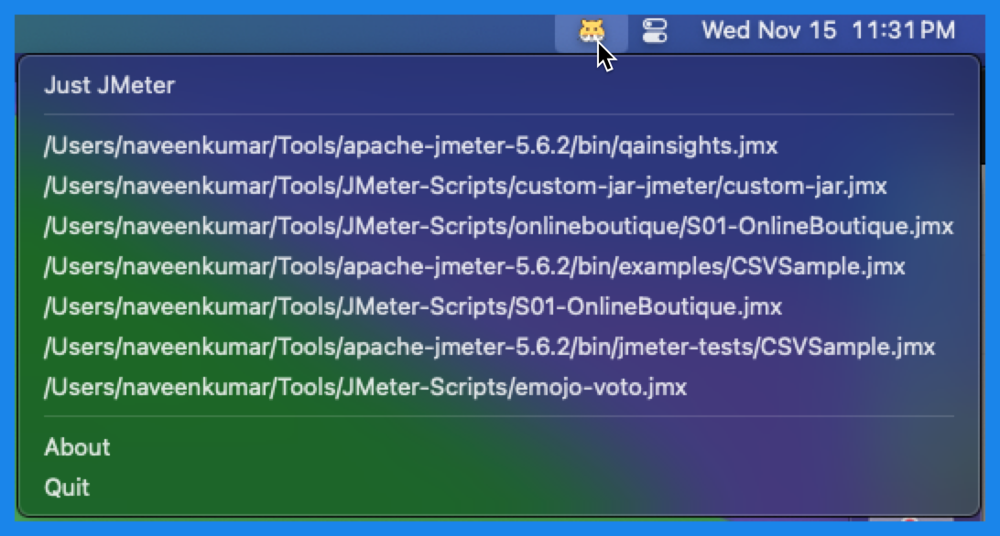
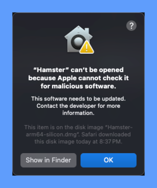
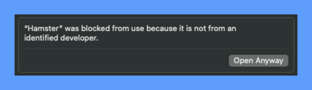

# 🐹 Hamster - Instantly Launch JMeter Test Plans 🚀

An app that puts your recent JMeter test plans just a click away from your Mac menu.



## Table of Contents

- [Features](#-features)
- [Usage](#-usage)
- [Build](#-build)
- [Install](#-install)
- [Points to Note](#-points-to-note)
- [Telemetry](#-telemetry)
- [License](#-license)
- [Sponsor](#-sponsor)

# ✅ Features
- 🎯 No more digging through folders or endless searches. With Hamster, launching your recent JMeter test plans is swift and seamless. Boost your productivity by accessing your tests instantly, streamlining your workflow like never before.
- 🌟 Whether you're a seasoned JMeter pro or just getting started, Hamster's user-friendly interface makes your testing experience effortless. Say hello to smoother workflows and goodbye to unnecessary hassle!
- 🚀 Hamster is a lightweight app that's easy to install and use. It's also open-source, so you can customize it to your liking. What's more, it's free! So what are you waiting for? Download Hamster today and take your testing to the next level.
- 🏛️ Supports Intel and Apple Silicon architectures.

## 📚 Usage

1. Configure `JMETER_HOME` by launching `Hamster > Edit JMETER_HOME` ⚙️
2. To launch JMeter, click on `Hamster > Just JMeter` 🚀
3. To launch JMeter test plans, click on `Hamster > Recent Test Plans > select the test plan` 🚀
4. To view the configuration, click on `Hamster > View Config` 👀
5. To refresh Hamster, click on` Hamster > Refresh` 🔄
6. To quit Hamster, click on `Hamster > Quit` ❌
7. To know more about Hamster, click on `Hamster > About` ℹ️

## 🚀 Build

1. Clone the repository:

    ```bash
    git clone https://github.com/qainsights/hamster.git
    ```
2. Create `venv` ⚙️

    ```
    python3 -m venv <venv_name>
    ```
3. Install the required dependencies:

    ```bash
    pip install -r requirements.txt
    ```
4. Run the project:
    ```bash
    python ./hamster/__main__.py
    ```

## 📥 Install

1. Download the `dmg` file based on your architecture from the latest release from [here](https://github.com/QAInsights/hamster/releases)
2. Double-click on the `dmg` file
3. If you see the below screen, click on `OK` button👇    
    
4. Go to `System Preferences > Security & Privacy > General > Click on Open Anyway` button 👇, then click on `Open` button    
    
5. Move the `Hamster.app` to `Applications` folder
6. Launch `Hamster.app` from `Applications` folder
7. Configure `JMETER_HOME` by launching `Hamster > Edit JMETER_HOME` ⚙️
8. To launch JMeter, click on `Hamster > Just JMeter` 🚀

## 🎯 Points to Note

- **Experimental App**: Please note that this application is experimental and may contain bugs. ⚠️
- **macOS**: This application is only for macOS and Windows.
- **JMeter**: This application requires JMeter to be installed on your machine. 📥

## 🔍 Telemetry

- Hamster collects anonymous usage data to improve the app. 📊
  - The data collected is the menu clicks only.
  - No personal information or entities are collected.
  - The data collected is not shared with any third-party.
  - The data collected is not used for any marketing purposes.
  - The data is being collected using [Mixpanel](https://mixpanel.com) via AWS Lambda.
- You can opt out of telemetry by configuring `false` in `~/.hamster_app.properties` file and restart the app.
  - ```commandline
    [TELEMETRY]
    enabled = false
    ```
- You can opt in of telemetry by configuring `true` in `~/.hamster_app.properties` file and restart the app.
  - ```commandline
    [TELEMETRY]
    enabled = true
    ```

## 🧩 Windows Vs Mac app features

| Features                        | Windows | Mac |
|---------------------------------|---------|-----|
| Launch JMeter                   | ✅       | ✅   |
| Launch JMeter Recent Test Plans | ✅       | ✅   |
| Set JMeter Home                 | ✅       | ✅   |
| View Config                     | ✅       | ✅   |
| Refresh                         | ✅       | ✅   |
| Telemetry                       | ❌       | ✅   |
| Updates                         | ❌       | ❌  |


## 🗒️ License
- Apache 2 License

## 💰 Sponsor
- [Buy me a coffee ☕](https://www.buymeacoffee.com/qainsights)

## 🙏 Thanks
- Logo sourced from [OpenMoji](https://openmoji.org/library/emoji-1F439/)
- My daughter for the name 🐹
