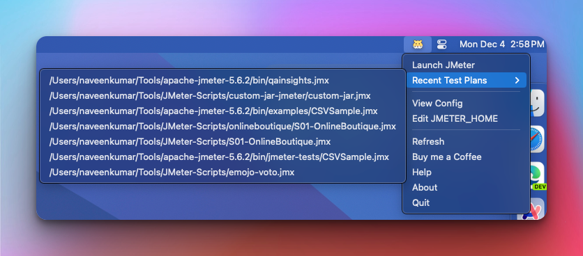

# 🐹 Hamster - Instantly Launch JMeter Test Plans 🚀

An app that puts your recent JMeter test plans just a click away from your Mac menu.



# ✅ Features

- 🎯 No more digging through folders or endless searches. With Hamster, launching your recent JMeter test plans is swift and seamless. Boost your productivity by accessing your tests instantly, streamlining your workflow like never before.

- 🌟 Whether you're a seasoned JMeter pro or just getting started, Hamster's user-friendly interface makes your testing experience effortless. Say hello to smoother workflows and goodbye to unnecessary hassle!

## Table of Contents

- [Build](#🚀-build)
- [Usage](#📚-usage)
- [Points to Note](#🎯-points-to-note)
- [License](#🗒️-license)

## 🚀 Build

1. Clone the repository:

    ```bash
    git clone https://github.com/qainsights/hamster.git
    ```
2. Create `venv` ⚙️

    ```
    python3 -m venv <venv_name>
    ```
3. Install the required dependencies:

    ```bash
    pip install -r requirements.txt
    ```
4. Run the project:
    ```bash
    python ./hamster/__main__.py
    ```

## 📚 Usage

1. Configure `JMETER_HOME` by launching `Hamster > Edit JMETER_HOME` ⚙️
2. To launch JMeter, click on `Hamster > Just JMeter` 🚀
3. To launch JMeter test plans, click on `Hamster > select the test plan` 🚀
4. To view the configuration, click on `Hamster > View Config` 👀
5. To restart Hamster, click on` Hamster > Restart` 🔄
6. To quit Hamster, click on `Hamster > Quit` ❌
7. To know more about Hamster, click on `Hamster > About` ℹ️
8. To refresh the recent test plans, click on `Hamster > Restart` 🔄

## 🎯 Points to Note

- **Experimental App**: Please note that this application is experimental and may contain bugs. ⚠️
- **Note**: This application may require restarting or refreshing the menu in order to fetch the changes from the PLIST file. 🔄

## 🗒️ License
- Apache 2
